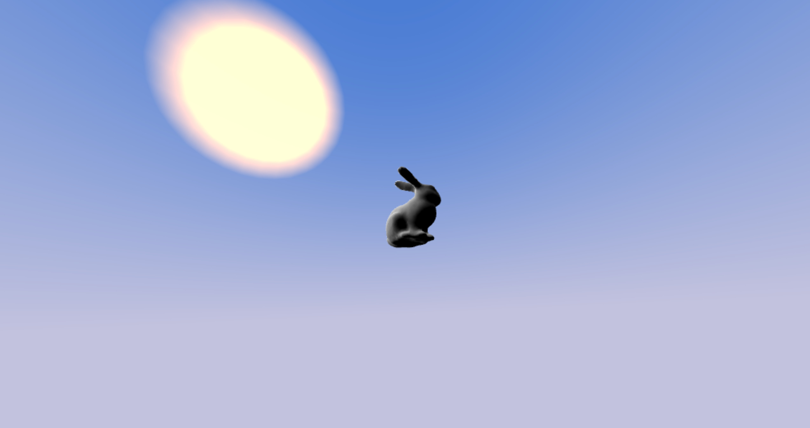

# gl-skydome-sun

Draws a skydome with a sun into a 3D scene. This project is a fork of the
module gl-skybox. Demo:
http://erkaman.github.io/gl-skydome-sun/



[](https://www.npmjs.com/package/gl-skydome-sun)

## Install

```sh
npm install gl-skydome-sun
```

## API

```js
var createSkydome = require('gl-skydome-sun')
```

### Constructor

#### `var skydome = createSkydome(gl)`

Takes a WebGL context `gl`. Returns an object `skybox` ready for rendering into your
scene.

### Methods

#### `skydome.draw(camera[, opts])`

Draws the skydome and sun into your scene.

Takes a `camera` object that defines the view and projection matrices:

```js
{
  view: gl-mat4 matrix,
  projection: gl-mat4 matrix
}
```

This function will take care of centering the skydome and projection near/far
values for you, so there is no need to make a view/projection matrix specifically
for rendering the skydome. It will also disable depth buffer read/writes and
then restore them to whatever you had them set to before returning, so there's
no need to handle that yourself.

The optional arguments are

* `opts.lowerColor` the color of the lower hemisphere of the skydome.
* `opts.upperColor` the color of the upper hemisphere of the skydome.
* `opts.sunDirection` A unit vector that describes the position of the sun on the
skydome. Note that it is assumed that this is a unit vector!
* `opts.sunColor` The color of the sun.
* `opts.sunSize` The size of the sun. Should be in the range `[0,500]`.
* `opts.renderSun` Whether or not to render the sun. Default value is `true`
* `opts.doDithering` Enables dithering. Dithering can be used to reduce banding artifacts in
the rendered sky(the artifacts are mostly visible when the color of the sky is rather dark). Default value is `true`.
* `opts.ditheringAmmount` The ammount of dithering to apply to every fragment
of the rendered sky. Default value is `0.005`.


#### `skydome.constructViewProjection(camera)`

Given a `camera` object, returns the view/projection matrices that is used
to render the skydome(see the documentation of `skydome.draw` for more details).
This function returns an object on the form


```js
{
  view: gl-mat4 matrix,
  projection: gl-mat4 matrix
}
```